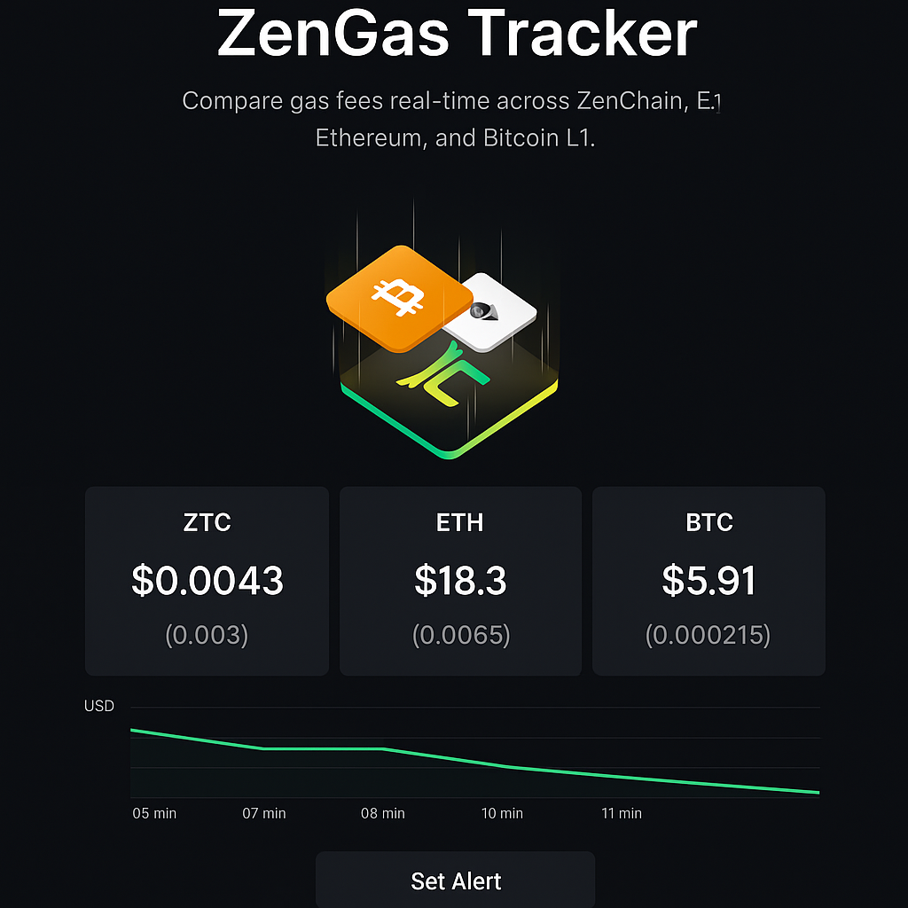

# ZenGas Tracker

ZenGas Tracker adalah aplikasi web untuk memantau biaya gas (fee) secara real-time di berbagai jaringan blockchain: **ZenChain, Ethereum, dan Bitcoin L1**.

## 🚀 Fitur
- Pelacak biaya gas multi-chain (ZenChain, Ethereum, Bitcoin)
- Konversi gas fee ke dalam USD menggunakan API CoinGecko
- Notifikasi peringatan (alert) ketika gas fee ZTC turun di bawah ambang batas
- Menu faucet untuk ETH, ZTC, dan BTC (testnet)
- Tampilan visual dengan gambar chain-stack

## 🖼️ Preview


## ⚡ Teknologi
- [Next.js](https://nextjs.org/) (React Framework)
- [Ethers.js](https://docs.ethers.io/)
- [CoinGecko API](https://www.coingecko.com/en/api)

## 📦 Cara Menjalankan Lokal
1. Clone repo:
   ```bash
   git clone https://github.com/USERNAME/zengas-tracker.git
   cd zengas-tracker
   ```

2. Install dependencies:
   ```bash
   npm install
   ```

3. Jalankan lokal:
   ```bash
   npm run dev
   ```

4. Build & export static site:
   ```bash
   npm run build
   ```

   Hasil build ada di folder `out/`.

---

## 🌍 Deploy ke GitHub Pages

Repo ini sudah disiapkan dengan **GitHub Actions**.

1. Push ke branch `main`:
   ```bash
   git add .
   git commit -m "Deploy ZenGas Tracker"
   git push origin main
   ```

2. GitHub Actions otomatis build & publish ke branch `gh-pages`.

3. Aktifkan **GitHub Pages** di repo:
   - Settings → Pages → Source: `gh-pages` branch, root folder `/`.

4. Tunggu 1–2 menit → aplikasi live di:
   ```
   https://USERNAME.github.io/zengas-tracker/
   ```

---

## 🔧 Konfigurasi Penting
- Pastikan `next.config.js` sudah sesuai dengan nama repo kamu:
  ```js
  module.exports = {
    output: "export",
    basePath: "/zengas-tracker",
    assetPrefix: "/zengas-tracker/"
  }
  ```

- Ganti `/zengas-tracker` sesuai nama repo kamu di GitHub.

---

## 📜 Lisensi
MIT License © 2025 ZenGas Tracker Contributors
